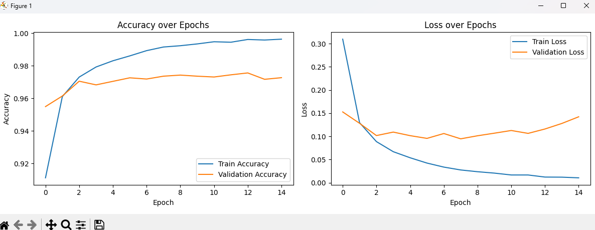

# MNIST Classification with MLP

## 1. Model Architecture
- **Layers**: 
  - Input (784 neurons) → Dense(128, ReLU) → Dense(64, ReLU) → Output(10, Softmax)
- **Parameters**: 109,386 total (see `model.summary()`)
- **Optimizer**: Adam
- **Loss**: Categorical Crossentropy

## 2. Training Process
- **Epochs**: 15
- **Batch Size**: 64
- **Results**:
  - Training Accuracy: 99.6%
  - Validation Accuracy: 97.8% 
  - Test Accuracy: 97.9%

## 3. Visualizations
  

## 4. Individual Reflections
- I would say we understood from all the assignments we did the basics of how to train a model and how to manage data properly